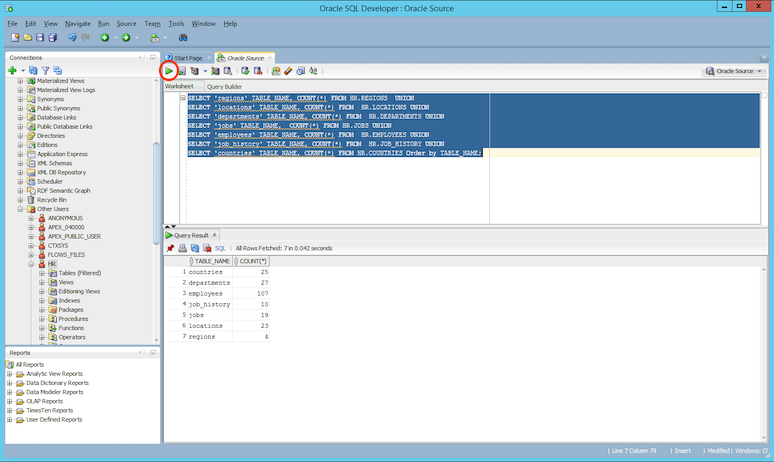
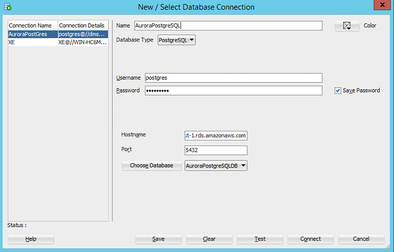
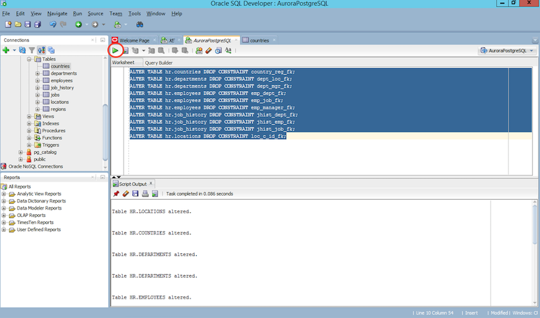
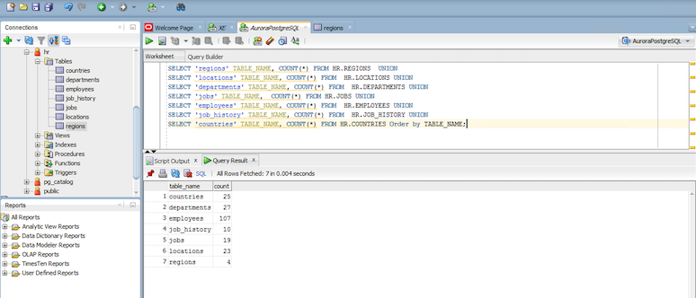

[Back to main guide](../README.md)|[Next](dms-cdc.md)

___

# Run the DMS Replication Task for full load (replicating the initial data)

In this activity, you perform the following tasks:

- Run a DMS Replication Task for full-load (migration of initial data)
    - Check the source database content for post-replication validation
    - Drop foreign keys on the target database
    - Setup and run a full-load Replication Task
    - Validate the data replication result
    - Restore the foreign keys


___

## Task 1 - Check the source database content for post-replication validation

1. Connect to the **OracleXE-SCT** EC2 instance using the following password 
    **Windows password**: GPSreInvent@321
2. Launch **SQL Developer** from the shortcut on the desktop. 
3. Right Click on `XE` under Connections and select properties to verify the following parameters.

Parameter | Value 
--- | --- 
Connection Name | XE 
Username| hr 
Password | hr123 
Save Password | checked 
Hostname | localhost    
Port| 1521 
SID | XE 


4. After you have connected to the Oracle database, right click on connection and click open worksheet. 
5. Run the following query on the SQL window to get a count of the rows in the tables by clicking green play button. 

````
SELECT 'regions' TABLE_NAME, COUNT(*) FROM HR.REGIONS  UNION
SELECT 'locations' TABLE_NAME, COUNT(*) FROM  HR.LOCATIONS UNION
SELECT 'departments' TABLE_NAME, COUNT(*) FROM  HR.DEPARTMENTS UNION
SELECT 'jobs' TABLE_NAME,  COUNT(*) FROM HR.JOBS UNION
SELECT 'employees' TABLE_NAME, COUNT(*) FROM  HR.EMPLOYEES UNION
SELECT 'job_history' TABLE_NAME, COUNT(*) FROM  HR.JOB_HISTORY UNION
SELECT 'countries' TABLE_NAME, COUNT(*) FROM HR.COUNTRIES;
````


___

## Task 2 -  Configure the target database schema for full load replication
Before running DMS Replication Task, you need to disable the foreign keys on the target database. 

1. Right Click on `AuroraPostgreSQL` under Connections and select properties to **modify** the following parameters.

Parameter | Value
--- | ---
Connection Name | AuroraPostgreSQL
Username| postgres
Password | Aurora321 
Save Password | checked 
Hostname | Get `AuroraPostgreSQLEndpoint` from [CloudFormation stack output](./lab-setup-verification.md)
Port| 5432
Database name | AuroraPostgreSQLDB



2. After you have connected to the Aurora database,right click on connection and click open worksheet. 
3. Drop foreign keys on the target Aurora database. Run the following query in the SQL window to drop foreign keys.
_Hint:Select all statements and click green play button_

```
ALTER TABLE hr.countries DROP CONSTRAINT country_reg_fk;
ALTER TABLE hr.departments DROP CONSTRAINT dept_loc_fk;
ALTER TABLE hr.departments DROP CONSTRAINT dept_mgr_fk;
ALTER TABLE hr.employees DROP CONSTRAINT emp_dept_fk;
ALTER TABLE hr.employees DROP CONSTRAINT emp_job_fk;
ALTER TABLE hr.employees DROP CONSTRAINT emp_manager_fk;
ALTER TABLE hr.job_history DROP CONSTRAINT jhist_dept_fk;
ALTER TABLE hr.job_history DROP CONSTRAINT jhist_emp_fk;
ALTER TABLE hr.job_history DROP CONSTRAINT jhist_job_fk;
ALTER TABLE hr.locations DROP CONSTRAINT loc_c_id_fk;
```



___

## Task 3 - Configure and run Replication Task
AWS DMS uses a Replication Task to migrate the data from source to the target database. In this part of the lab, you are going to create a Replication Task for migrating the existing data.

1. Click on **Database migration tasks** on the navigation menu, then click on the **Create task** button.


2. Create a data migration task with the following values for migrating the `HR` database.

Parameter | Value
--- | ---
Task identifier | oracle-migration-task
Replication instance | your replication instance
Source database endpoint | oracle-source
Target database endpoint | aurora-postgresql-target
Migration type | Migrate existing data
Start task on create | Checked
Target table preparation mode | Truncate
Include LOB columns in replication | Limited LOB mode
Max LOB size (KB) | 32
Enable validation | Unchecked
Enable CloudWatch logs | Checked

*Enabling logging would help debug issues that DMS encounters during data migration*

3. Expand the Table mappings section, and select Guided UI for the editing mode
4. Click on Add new selection rule button and enter the following values:

Parameter | Value
----- | -----
Schema name | HR
Table name| %
Action | Include

_Hint:click “Enter a schema” from drop down to enter the schema name._

5. Next, expand the Transformation rules section, and click on Add new transformation rule. Then, create the following rules:

Parameter | Value
-------- | --------
Target | Schema
Schema name | HR
Action | Make lowercase

Parameter | Value
-------- | --------
Target | Table
Schema Name | HR
Table Name | %
Action | Make lowercase

Parameter | Value
-------- | --------
Target | Column
Schema Name | HR
Table Name | %
Column Name | %
Action | Make lowercase


6. After entering the values click on **Create task**.
7. At this point, the task should start migrating data from the source Oracle database to the Amazon Aurora RDS instance.

8. Go to **Database migration tasks** to monitor the task progress and once the task status is **Load complete**, your data should have been migrated to the target database. This may take couple of minutes, Wait till the task status becomes load completed.


___

## Task 4 - Validate the migration result 

1. Click on your task **oracle-migration-task** and scroll to the **Table statistics** section to view how many rows have been moved.
    
2. If there is any error, the status color changes from green to red. Click on the **View logs** link for the logs.
3. On the target Aurora database, check the tables for migrated data using SQL Developer.
     

___

## Task 5 - Restore the foreign keys 
1. After the full load is complete, enable the foreign key constraints on the target database.

```
ALTER TABLE hr.locations
ADD CONSTRAINT loc_c_id_fk FOREIGN KEY (country_id) 
REFERENCES hr.countries (country_id)
ON DELETE NO ACTION;

ALTER TABLE hr.countries
ADD CONSTRAINT country_reg_fk FOREIGN KEY (region_id) 
REFERENCES hr.regions (region_id)
ON DELETE NO ACTION;

ALTER TABLE hr.employees
ADD CONSTRAINT emp_dept_fk FOREIGN KEY (department_id) 
REFERENCES hr.departments (department_id)
ON DELETE NO ACTION;

ALTER TABLE hr.job_history
ADD CONSTRAINT jhist_dept_fk FOREIGN KEY (department_id) 
REFERENCES hr.departments (department_id)
ON DELETE NO ACTION;

ALTER TABLE hr.departments
ADD CONSTRAINT dept_loc_fk FOREIGN KEY (location_id) 
REFERENCES hr.locations (location_id)
ON DELETE NO ACTION;

ALTER TABLE hr.departments
ADD CONSTRAINT dept_mgr_fk FOREIGN KEY (manager_id) 
REFERENCES hr.employees (employee_id)
ON DELETE NO ACTION;

ALTER TABLE hr.employees
ADD CONSTRAINT emp_manager_fk FOREIGN KEY (manager_id) 
REFERENCES hr.employees (employee_id)
ON DELETE NO ACTION;

ALTER TABLE hr.job_history
ADD CONSTRAINT jhist_emp_fk FOREIGN KEY (employee_id) 
REFERENCES hr.employees (employee_id)
ON DELETE NO ACTION;

ALTER TABLE hr.employees
ADD CONSTRAINT emp_job_fk FOREIGN KEY (job_id) 
REFERENCES hr.jobs (job_id)
ON DELETE NO ACTION;

ALTER TABLE hr.job_history
ADD CONSTRAINT jhist_job_fk FOREIGN KEY (job_id) 
REFERENCES hr.jobs (job_id)
ON DELETE NO ACTION;

```
___

## Conclusion
This part of the workshop demonstrated heterogeneous database migration, from Oracle to Aurora PostgreSQL by AWS Database Migration Service (DMS). 
___

[Back to main guide](../README.md)|[Next](dms-cdc.md)