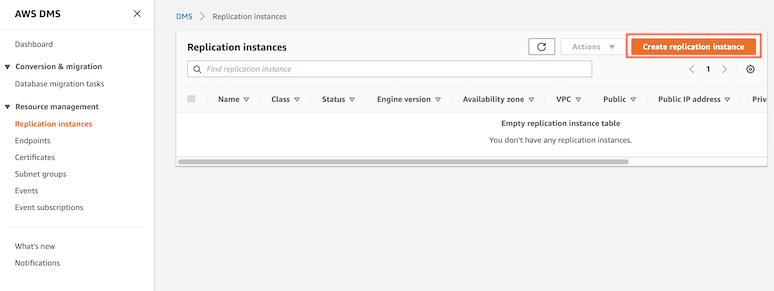
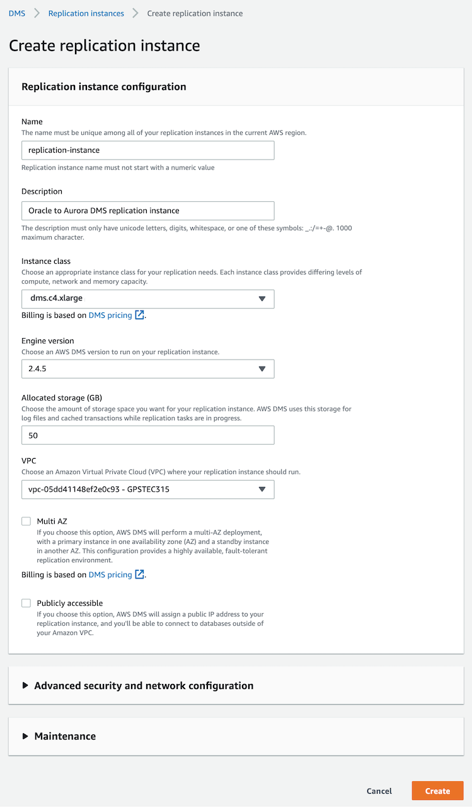
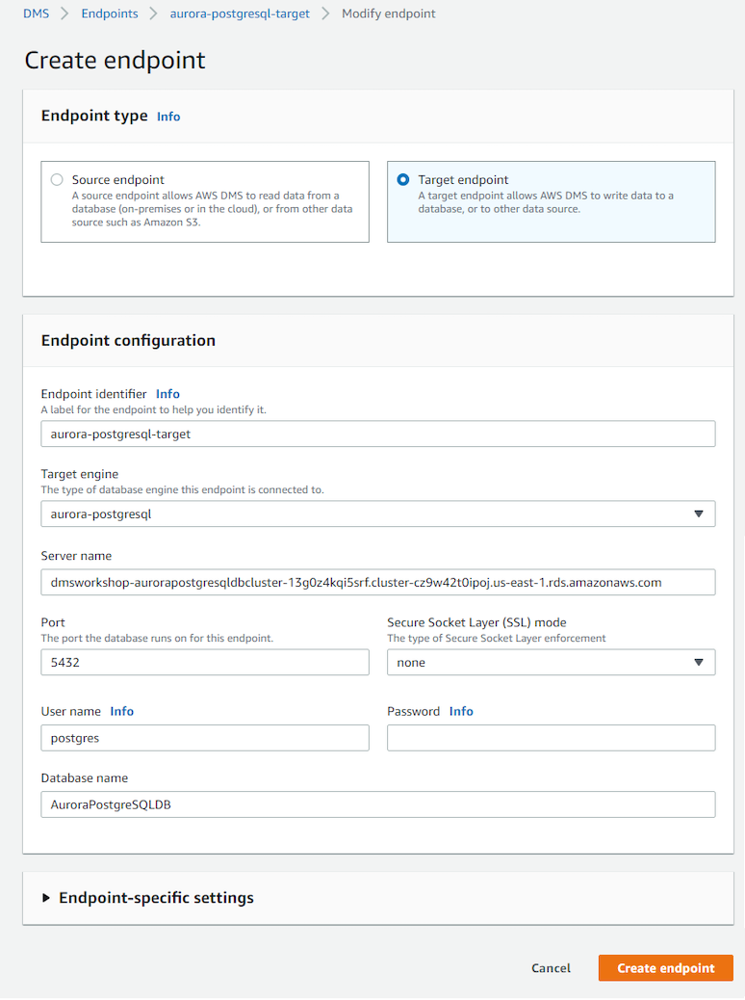

[Back to main guide](../README.md)|[Next](dms-fl.md)

___

# Database Migration Service (DMS)

The AWS Database Migration Service helps you migrate databases to AWS easily and securely. The source database remains fully operational during the migration, minimizing downtime to applications that rely on the database. The AWS Database Migration Service can migrate your data to and from most widely used commercial and open-source databases. AWS Database Migration Service can also be used for continuous data replication with high availability.

This lab will walk you through the steps to Create a DMS Replication Instance and endpoints.

In this activity, you perform the following tasks:

- Create a DMS Replication Instance
- Create DMS source and target endpoints

___

## Task 1 - Create a DMS Replication Instance

1. Go to the [AWS DMS console](https://console.aws.amazon.com/dms/v2/) and click on Replication Instances on the navigation menu. This will launch the **Replication instance** screen in the Database Migration Service.
2. Click on the **Create replication instance** button on the top right side.

3. Configure the replication instance with the following parameter values. Then, click on the **Create** button.

Parameter | Value
--- | --- 
Name | replication-instance 
Description | Oracle to Aurora DMS replication instance 
Instance Class | dms.c4.xlarge 
Replication engine version | 2.4.5 
VPC | vpc-xxxxxxxxx (VpcId from [CloudFormation stack output](./lab-setup-verification.md#cloudformation-stack-outputs))
Allocated storage (GB) | Leave default
Multi-AZ | Unchecked 
Publicly accessible | Unchecked 

_Note: Creation of the replication instance takes a few minutes. While waiting for the replication instance to be created, you can proceed with creation of source and target database endpoints in the next step. However, you can test the endpoint connectivity only after the replication instance has been created._

___

## Task 2 - Create DMS source and target endpoints

1. Click on the **Endpoints** link on the left menu, and then click on Create endpoint on the top right corner.

2. Enter the Connection details for the source endpoint as shown in the following table. 

Parameter | Value
--- | ---
Endpoint type | Source endpoint
Endpoint identifier | oracle-source
Source engine | oracle
Server name | Get `OracleSCTInstancePrivateIP` from [CloudFormation stack output](./lab-setup-verification.md#cloudformation-stack-outputs)
Port | 1521
SSL mode | none 
User name | hr
Password | hr123
SID | XE

3. Once the information has been entered, click **Run Test** under **Endpoint-specific settings**. When the status turns to successful, click **Create endpoint**.

_Note: You can test the endpoint connectivity only after the replication instance has been created, wait for the replication instance creation to be completed.

4. Repeat the previous steps to create the target endpoint for the Aurora PostgreSQL database with the following values. 

Parameter | Value 
--- | --- 
Endpoint type | Target endpoint 
Endpoint identifier | aurora-postgresql-target 
Source engine | aurora-postgresql 
Server name | [Get `AuroraPostgreSQLEndpoint` from CloudFormation stack output](./lab-setup-verification.md#cloudformation-stack-outputs)
Port | 5432 
SSL mode | none 
User name | postgres 
Password | Aurora321 
Database name | AuroraPostgreSQLDB 

5. Once the information has been entered, click **Run Test** under **Endpoint-specific settings**. When the status turns to successful, click **Create endpoint**.

___

[Back to main guide](../README.md)|[Next](dms-fl.md)